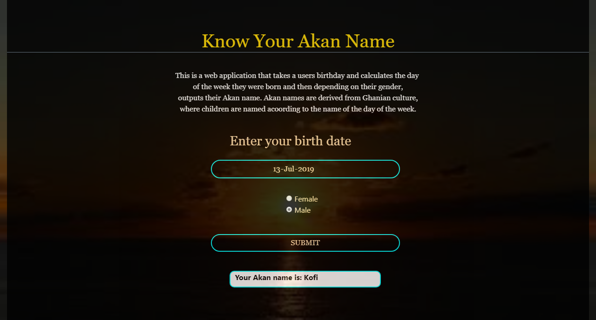

## Project Name
### Akan Names

## Description
#### This is a web application that prompts the user to input their date of birth, calculates the day of the week they were born and in return gives back an Akan name corresponding to that day. Akan names are Ghanian culture of naming children according to the name of the day they are born.

## Author
#### Irene Mercy

## Behaviour Driven Development
#### As a user, I should be able to see a small description, so as to understand the application.
#### As a user, I should be able to enter my date of birth through a form.
#### As a user, I  should be able to choose my gender through radio buttons.
#### As a user, I should be able to click the submit button and get back my Akan name according to my gender.

#### Scenario:
##### Given that:
##### the user enter valid date of birth on the date picker,
##### Selects their gender through radio buttons,
##### and then click the submit button,
##### then the user should get the result of their Akan name on an alert.

## Link
https://irenemercy.github.io/Kan-Names/

## Project Installation
#### Fork the repository
#### On your terminal run the command git clone "the project link" https://irenemercy.github.io/Kan-Names/
#### On your terminal run the command cd Kan-Names
#### On your terminal run the command code . to open the project on your text editor

## Technologies Used
#### Bootstrap
#### HTML
#### CSS
#### JavaScript
#### md

## Demo

## Copyright
#### Irene Mercy Oyoo

## License
#### MIT License

## Contact Details
#### irenemercy700@gmail.com
