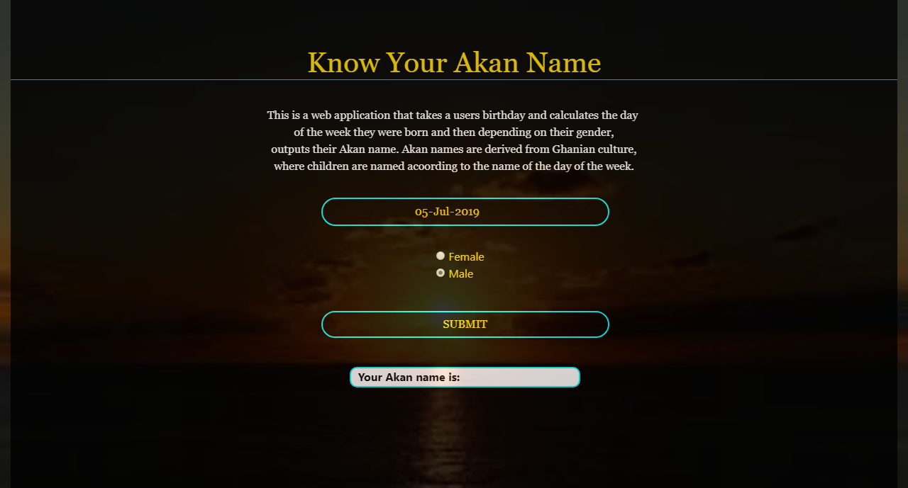

## Project Name
### Akan Names

## Description
#### This is a web application that prompts the user to input their date of birth, calculates the day of the week they were born and in return gives back an Akan name corresponding to that day. Akan names are Ghanian culture of naming children according to the name of the day they are born.

## Author
#### Irene Mercy

## Behaviour Driven Development
#### A user should be able to see a small description, so as to understand the application.
#### A user should be able to enter their date of birth through a form.
#### A user should be able to choose their gender through radio buttons.
#### A user should be able to click the submit button and get back their Akan name according to their gender.

## Link
https://irenemercy.github.io/Kan-Names/

## Project Installation
#### Fork the repository
#### On your terminal run git clone the project https://irenemercy.github.io/Kan-Names/
#### On your terminal run the command cd Kan-Names
#### Run the command code . to open the project on your text editor

## Technologies Used
#### Bootstrap
#### HTML
#### CSS
#### JavaScript
#### md

## Demo

## Copyright
#### Irene Mercy Oyoo

## License
#### MIT License

## Contact Details
#### irenemercy700@gmail.com
